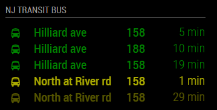
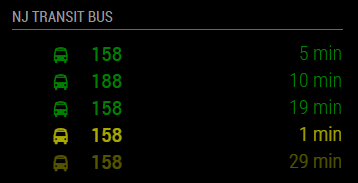
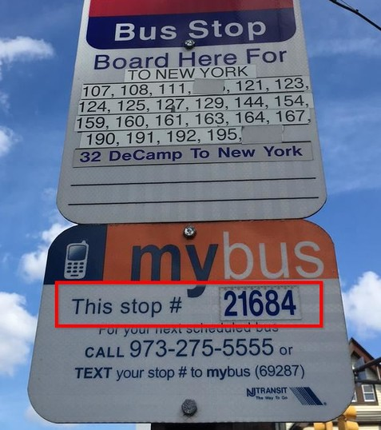

# MagicMirror Module: NJ Transit (MyBus Now)
`MMM-NJTransit` is a module for the [MagicMirror](https://github.com/MichMich/MagicMirror). It displays real-time arrival times for NJ Transit Bus. The data is sourced via the [NJ Transit (MyBus Now)](http://mybusnow.njtransit.com/bustime/home.jsp). There is no public API but you can easily to peek and see it in browser inspector.


  

# Usage
## Installation
### 1. Clone this module into your MagicMirror's `modules` directory
```bash
MagicMirror$ cd modules
modules$ git clone https://github.com/dimitrystd/MMM-NJTransit.git
```

### 2. Install this module's dependencies
```bash
modules$ cd MMM-NJTransit
MMM-NJTransit$ npm install --production
```

### 3. Add this module to your MM config's `modules` array
```bash
MMM-NJTransit$ cd ../..
MagicMirror$ nano config/config.js
```

Configure as described below and restart your MagicMirror.

## A typical configuration example
```javascript
/* MagicMirror/config/config.js */
{
    /* ...your other config here */
    
    modules: [

        /* ...your other modules here */

        {
            module: "MMM-NJTransit",
            position: "top_left",
            header: "NJ Transit buses",
            config: {
                colored: true,
                stops: [{
                        id: "11500",
                        label: "North st",
                        color: "yellow",
                        routes: ["40"]
                    },
                    {
                        id: "12060",
                        label: "George rd",
                        color: "green"
                    }
                ]
            }
        }
    ]
}
```

## The full configuration explained
```javascript
/* MagicMirror/config/config.js */
{
    modules: [{
        module: "MMM-NJTransit",

        /* the usual MM module settings */
        position: "top_left",
        header: "Bus & Rail",

        /* configure this module */
        config: {

            /* the bus stops to show events for.
             * this is the most important part of the configuration.
             * TYPE: array of objects
             * REQUIRED: no (but it won't be very useful if left empty)
             * DEFAULT: [] (empty) */
            stops: [{
                    /* ID of the bus stop to show events for.
                     * see below for details on finding the right stop IDs.
                     * TYPE: string
                     * REQUIRED: yes */
                    id: "123",

                    /* a friendly name to display instead of the stop ID.
                     * because the stop ID often isn't very meaningful.
                     * TYPE: string
                     * REQUIRED: no
                     * DEFAULT: the stop ID */
                    label: "River rd",

                    /* select which routes to show events for at this stop.
                     * routes which don't match any of these strings EXACTLY
                     * will not be displayed. letters are not case-sensitive.
                     * if left empty, will show all routes at the stop.
                     * TYPE: array of strings
                     * REQUIRED: no
                     * DEFAULT: [] (empty) */
                    routes: ["123", "156"],

                    /* select which destinations to show events for at this stop.
                     * destinations which don't CONTAIN any of these strings
                     * will not be displayed. letters are not case-sensitive.
                     * the value you can use here depends on the route.
                     * if left empty, will show all directions at the stop.
                     * NOTE: "Connolly" is contained in "Dublin Connolly" as well as "LUAS Connolly".
                     * TYPE: array of strings
                     * REQUIRED: no
                     * DEFAULT: [] (empty) */
                    destinations: ["new york", "bloomfield"],

                    /* the FontAwesome symbol to use for events at this stop.
                     * TYPE: string (see https://fontawesome.com/icons)
                     * REQUIRED: no
                     * DEFAULT: autodetect based on the stop ID
                     * - "bus" for Dublin Bus stops */
                    symbol: "beer",

                    /* the color to use for events at this stop.
                     * requires the module option 'colored' to be 'true'
                     * TYPE: string (CSS values, see https://www.w3schools.com/colors/colors_names.asp)
                     * REQUIRED: no
                     * DEFAULT: magic mirror default text color */
                    color: "pink",

                    /* maximum number of events to display for this stop.
                     * TYPE: uint
                     * REQUIRED: no
                     * DEFAULT: value of module config */
                    maximumEntries: 10,

                    /* hide events with a dueTime greater than this.
                     * TYPE: uint (minutes)
                     * REQUIRED: no
                     * DEFAULT: value of module config */
                    maximumNumberOfMinutes: 60,
                },
                /* configure more stops if you wish to */
            ],


            /* choose specific routes to be displayed for stops which
             * don't have routes explicitly defined. per-stop config
             * takes preference. see stop config above for more details.
             * TYPE: array of strings
             * REQUIRED: no
             * DEFAULT: [] (empty) */
            routes: ["123", "156"],

            /* choose specific directions to be displayed for stops which
             * don't have directions explicitly defined. per-stop config
             * takes preference. see stop config above for more details.
             * TYPE: array of strings
             * REQUIRED: no
             * DEFAULT: [] (empty) */
            destinations: ["new york", "bloomfield"],

            /* maximum number of events to display IN TOTAL.
             * TYPE: uint
             * REQUIRED: no
             * DEFAULT: 10 */
            maximumEntries: 10,

            /* hide events with a duetime later than this.
             * TYPE: uint (minutes)
             * REQUIRED: no
             * DEFAULT: 60 */
            maximumNumberOfMinutes: 60,

            /* display a symbol for each event.
             * TYPE: boolean
             * REQUIRED: no
             * DEFAULT: true */
            displaySymbol: true,

            /* display the bus stop name.
             * TYPE: boolean
             * REQUIRED: no
             * DEFAULT: true */
            displayStopName: true,

            /* display the bus route.
             * TYPE: boolean
             * REQUIRED: no
             * DEFAULT: true */
            displayRoute: true,

            /* display the destination of each event.
             * TYPE: boolean
             * REQUIRED: no
             * DEFAULT: true */
            displayDestination: true,

            /* how long to wait before fetching new data.
             * TYPE: uint (milliseconds)
             * REQUIRED: no
             * DEFAULT: 60000 (1 minute) */
            fetchInterval: 60000,

            /* the time an update animation takes.
             * TYPE: uint (milliseconds)
             * REQUIRED: no
             * DEFAULT: 2000 (2 seconds) */
            animationSpeed: 1000,

            /* gradually fade out events towards the bottom.
             * TYPE: boolean
             * REQUIRED: no
             * DEFAULT: true */
            fade: true,

            /* when to begin fading out events in the list.
             * value between 0 and 1, where 0 is the top and
             * 1 is the bottom of the list.
             * TYPE: float (0-1)
             * REQUIRED: no
             * DEFAULT: 0.25 */
            fadePoint: 0.25,

            /* use colors to display the events.
             * colors are individually set on the stops.
             * TYPE: boolean
             * REQUIRED: no
             * DEFAULT: false */
            colored: false,

            /* broadcast all the events to all other modules.
             * notification: `NJT_EVENTS`
             * TYPE: boolean
             * REQUIRED: no
             * DEFAULT: true */
            broadcastEvents: true,
        }
    }]

}
```

## Finding your stop ID


The ID on this sign refers to `21684`.

### Customisation
You can customize this module in many ways.
- combine several stops into a single MM module
- group stops into separate MM modules by service, stop, direction, etc.
- assign stops different colors and symbols via the `symbol` and `color` settings
- hide some or all parts of the displayed events via the `displaySymbol`, `displayStopName`, `displayRoute` and `displayDestination` settings
- further modify how the parts of an event are styles by editing the [`default.css`](./default.css) file directly

The naming used to describe the different parts of an event in the module are as follows:


# Kudos
The idea and code blueprint was taken from [`DublinRTPI`](https://github.com/galaktor/DublinRTPI) module.
